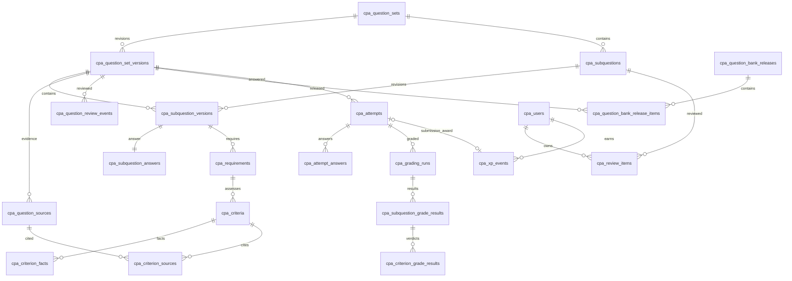

# CPA 문제은행 v3·학습 기록 DB 설계

작성: 2026-09-08. **운영 DB에 20개 신규 테이블과 최종 정본 96세트·192물음·521criterion을 적용했다.** 실제 적용 이력·앱 전환 상태는 [구현 기록](CPA-학습-DB-구현-전환-기록.md)을 따른다. 최신 사용자 지시에 따라 문항 재검증 없이 식별한 최종 파일을 그대로 이관했으며 기존 제한·출처 메타데이터도 보존한다. `plan-strict`는 사용자 요청으로 제거했고 스킬 없이 진행했다.

핵심은 **문제·물음의 고정 ID와 개정 버전을 분리하고, 제출 당시 버전·답안·채점 결과를 함께 보존하는 것**이다. 경험치는 제출 원장으로 중복과 유실을 막고, 오답노트와 랭킹은 그 기록에서 만든다.

## 1. 확정한 정책과 설계 범위

| 항목 | 정책 |
|---|---|
| 문제·물음 | 최종 수정된 v3 구조와 의미를 보존한다. 공개한 버전의 본문·정답·배점은 덮어쓰지 않는다. |
| 채점 | AI는 criterion 판정·인용을 반환한다. 인용 검증, 부분점수 계약, 보안 반영, 정수 점수 합산은 코드가 수행한다. |
| 경험치 | **새 제출마다 획득 점수 전액 적립**. 답안 내용이 같아도 새 제출이면 적립한다. 동일 제출의 통신 재시도·중복 클릭에는 한 번만 적립한다. 기존 경험치는 유지한다. |
| 오답노트 | **감점된 물음을 자동 등록**하고 수동 추가·해제를 허용한다. **사용자가 직접 해결 표시할 때까지 유지**하며, 재풀이 만점으로 자동 해결하지 않는다. |
| 풀이 이력 | 회원의 제출 원문과 모든 완료 채점 결과를 보존한다. 회원 탈퇴·명시적 삭제 정책은 별도로 적용한다. |
| 비회원 | 제출 당시 익명 여부를 기록하고 **제출 후 7일간만 답안·채점 결과를 보관**한다. 경험치·랭킹에는 포함하지 않는다. |
| 랭킹 | 누적·주간·월간 경험치 순위 모두 제공한다. |
| 이름 | 신규 물리 테이블은 `public.cpa_*`. 기존 `cpa_firm_*`, 다른 앱의 `cta_*`는 변경하지 않는다. |

앞의 경험치·정수 배점·모두 작성 정책은 [기존 수정 결정](plans/주제-01-03-검토에-따른-수정-결정.md)에 이미 확정돼 있다. 오답노트 운영, 비회원 7일 보관, 기간 랭킹은 이번 대화에서 확정했다.

다음은 구현 가능한 기본 설계값이다. 주간은 한국 시간 월요일 00:00부터, 월간은 한국 시간 매월 1일 00:00부터 계산한다. 동점은 공동 순위로 표시한다. 영구 오답노트는 회원 기능으로 두고, 비회원은 단기 풀이 결과만 보관한다. 비회원 시절 제출은 이후 회원이 되더라도 자동으로 영구 기록이나 경험치로 전환하지 않는다. 기존 계정과의 기록 병합도 이번 범위에 포함하지 않는다.

문제 편집은 우선 기존 로컬 authoring·검수 도구를 유지하고, 검증된 최종본을 DB의 새 버전으로 가져온다. 전환 후 **서비스 조회·채점·이력의 기준은 DB**이며, 파일은 편집 입력 및 동일 릴리스의 백업·내보내기 용도다. 웹 출제 편집기와 Git↔DB 양방향 동기화는 별도 기능이다.

## 2. 현재 확인한 상태

2026-09-08 연결된 Supabase 프로젝트 `xvifzicrjmbfqaepcfpp`의 테이블·컬럼·제약·정책과 현재 작업 트리를 읽기 전용으로 확인했다. 사용자 답안이나 회원 개인정보 원문은 조회하지 않았다.

| 현재 저장소 | 확인 결과 | 전환 방향 |
|---|---|---|
| authoring/public/encrypted v3 JSON | `lib/questionV3Store.ts`가 파일을 로드 | 정규화한 버전 테이블로 이관 |
| `cpa_users` | 3행. `id uuid` → `auth.users`; `username`, `role`, `level int`, `exp int` | 유지. `exp/level`은 원장 기반 조회 캐시로 사용 |
| `cpa_questions_v2` | 107행. 숫자 ID, 모범답안·rubric 포함 | 기존 자료로 유지. v3의 FK 대상이 아님 |
| `cpa_review_notes` | 0행. 숫자 문제 ID, 사용자·문제 UNIQUE, v2 FK | 기존 테이블 유지. 새 v3 오답노트와 분리 |
| `cpa_rate_limits` | 채점 한도 상태 저장 | 유지. 제출 중복 방지와 별개 |
| v3 답안·채점 결과 | `QuizClient`의 React state에만 존재 | 제출·물음 답안·채점 실행·판정으로 저장 |
| 경험치 증가 | `SELECT exp` 후 `UPDATE`; 제출 ID 없음 | 원자적 적립과 멱등키 도입 |
| 랭킹 | `cpa_users.exp` 내림차순 상위 10명 | 누적 캐시 + 기간별 원장 집계 |

문항이 병행 수정되고 있어 조사 중 criterion 수가 바뀌었다. 이 문서의 검증 실행에서는 **96세트·192물음·514criterion·514점**이었다. 이는 최종 이관 건수가 아니다. 이관 직전에 파일 SHA-256, 구조 해시, 세트·물음·criterion 수와 총점을 다시 고정한다.

## 3. 전체 테이블 구성

**신규 20개 테이블**, 기존 `cpa_users`·`cpa_rate_limits` 재사용, 공개 조회와 통계는 서버의 허용 필드 조회 및 집계로 시작한다. 배열 안의 단순 표시값까지 테이블로 쪼개지는 않는다.

| 영역 | 신규 테이블 | 역할 |
|---|---|---|
| 문제 식별 | `cpa_question_sets`, `cpa_subquestions` | 개정 후에도 유지되는 문제·물음의 정체성 |
| 문제 버전 | `cpa_question_set_versions`, `cpa_subquestion_versions` | 당시 본문·분류·공통 지문·순서·입력 계약 |
| 정답·근거 | `cpa_subquestion_answers`, `cpa_question_sources`, `cpa_requirements`, `cpa_criteria`, `cpa_criterion_sources`, `cpa_criterion_facts` | 모범답안·판단 정답·기준서 인용·채점요소 |
| 검수·게시 | `cpa_question_review_events`, `cpa_question_bank_releases`, `cpa_question_bank_release_items` | 검수 근거·전체 은행의 일괄 게시·이관 장부 |
| 제출·채점 | `cpa_attempts`, `cpa_attempt_answers`, `cpa_grading_runs`, `cpa_subquestion_grade_results`, `cpa_criterion_grade_results` | 답안 원문·실행 이력·코드로 확정한 점수 |
| 오답노트 | `cpa_review_items` | 회원별 물음 카드·상태·개인 메모 |
| 경험치 | `cpa_xp_events` | 기존 잔액·제출 보상·정정의 원장 |

`cpa_attempts.owner_user_id`는 `auth.users.id`를 참조하므로 영구 프로필이 없는 비회원도 저장할 수 있다. 위 ERD는 핵심 관계만 표시한다. 정정 이벤트를 위한 추가 경험치 관계와 버전 소속 검증 FK는 아래 명세를 따른다.

## 4. 컬럼·키 설계

표기: PK=기본키, FK=외래키, UQ=유일 제약, `?`=NULL 허용. 새 내부 식별자는 서버 발급 `uuid`, 시각은 `timestamptz`, 점수는 정수다. 별도 표시가 없는 필드는 NOT NULL이다. 상태값은 PostgreSQL enum보다 `text + CHECK`로 정의해 후속 변경을 작게 한다.

### 4.1 문제와 물음의 고정 ID

| 테이블 | 주요 컬럼 | 키·규칙 |
|---|---|---|
| `cpa_question_sets` | `id text`, `created_at`, `archived_at?` | PK `id`. `pilot-01-001` 등 기존 ID 보존. 개정번호는 ID에 붙이지 않는다. |
| `cpa_subquestions` | `id uuid`, `set_id text`, `code text`, `created_at`, `archived_at?` | PK `id`; FK `set_id`; UQ `(set_id,code)`, `(id,set_id)`. `sub1`, `subq1` 등 기존 코드 보존. |

물음 문구만 고치면 같은 `subquestion_id`의 새 버전이다. 물음을 삭제 후 다른 의미로 대체하거나 분할·통합하면 새 고정 ID를 만들고 과거 물음은 보관한다. 기존 코드를 다른 물음에 재사용하지 않는다. 버전에서 참조한 고정 ID와 `subquestions.set_id/code`는 변경할 수 없다. 보관 상태만 갱신한다.

### 4.2 공개 버전과 비공개 정답

| 테이블 | 주요 컬럼 | 키·규칙 |
|---|---|---|
| `cpa_question_set_versions` | `id uuid`, `set_id text`, `revision int`, `schema_version text`, `status text`, `title text`, `topic_id text`, `part text`, `chapter text`, `domain text`, `standards text[]`, `tags text[]`, `shared_facts jsonb`, `source_fidelity text`, `review_status text`, `calculation_required bool`, `verification_notes text[]`, `applicability jsonb`, `content_hash text`, `max_points int`, `created_at`, `sealed_at?` | PK `id`; UQ `(set_id,revision)`, `(id,set_id)`; `revision>0`; `schema_version='3.0'`. `part/chapter`는 문자열을 보존한다. |
| `cpa_subquestion_versions` | `id uuid`, `set_version_id uuid`, `set_id text`, `subquestion_id uuid`, `position int`, `learning_position int`, `type text`, `prompt text`, `ordered bool`, `max_entries int?`, `overflow_policy text`, `selection_type text`, `selection_n int?`, `decision_options text[]?`, `answer_slots jsonb`, `max_points int` | PK `id`; UQ `(set_version_id,subquestion_id)`, `(set_version_id,position)`, `(set_version_id,learning_position)`, `(id,set_version_id)`. 소속 FK는 아래 참조. |
| `cpa_subquestion_answers` | `subquestion_version_id uuid`, `model_answer text[]`, `decision_correct text?` | PK/FK `subquestion_version_id`로 1:1. 기존 optional decision이 있을 때만 correct와 options를 함께 저장. |

`status`는 기존 `needs_review/verified/published`, `review_status`는 기존 `needs_human_review/verified/published`를 정확히 매핑한다. 게시 여부와 2027년 시험 적용 적합성을 같은 값으로 취급하지 않는다. `applicability`에는 시험연도, 기준판본, 확인/가정/미확정 상태, 근거 문서 식별자를 보존한다. 검토 노트와 applicability의 자유 텍스트는 공개 DTO에 포함하지 않는다.

`shared_facts`는 `{id,text,scoreable:false}[]`를 검증해 보관한다. `standards/tags/decision_options/answer_slots`도 기존 배열 순서를 보존한다. `decision`은 물음 type과 독립적인 선택 필드다. 선택지가 없는 judgment와 선택지가 있는 descriptive 모두 현재 존재하므로 type에 따라 decision을 강제하거나 제거하지 않는다. decision이 있을 때만 options/correct 쌍과 correct의 선택지 소속을 검증한다. 내용상 시점·선후관계는 발문·criterion에 남기며 표시 순서와 구분한다.

**실제 이관 계약:** `selection_type='all'`, `selection_n IS NULL`을 유지한다. 최신 지시에 따라 식별된 정본을 원문대로 보존하며 `ordered`는 boolean, `max_entries`는 NULL 또는 양의 정수, `overflow_policy`는 none/ignore_after_limit을 허용한다. DB 기본값으로 현재 원문의 제한 필드를 치환하지 않는다. `source_fidelity`는 완료기록에 있는 excerpt도 지원한다.

### 4.3 출처·요구사항·criterion

| 테이블 | 주요 컬럼 | 키·규칙 |
|---|---|---|
| `cpa_question_sources` | `id uuid`, `set_version_id uuid`, `code text`, `position int`, `file_path text`, `title text?`, `page_label text?`, `role text`, `source_quote text`, `quote_hash text?`, `document_hash text?`, `edition_metadata jsonb` | PK `id`; UQ `(set_version_id,code)`, `(set_version_id,position)`, `(id,set_version_id)`. `role`: question/answer/standard/practice. |
| `cpa_requirements` | `id uuid`, `subquestion_version_id uuid`, `set_version_id uuid`, `code text`, `position int`, `source_id uuid`, `source_quote text`, `source_span text?` | PK `id`; UQ `(subquestion_version_id,code)`, `(subquestion_version_id,position)`, `(id,subquestion_version_id,set_version_id)`. |
| `cpa_criteria` | `id uuid`, `subquestion_version_id uuid`, `set_version_id uuid`, `code text`, `position int`, `requirement_id uuid`, `claim text`, `max_points smallint`, `partial_points smallint?` | PK `id`; UQ `(subquestion_version_id,code)`, `(subquestion_version_id,position)`, `(id,subquestion_version_id,set_version_id)`. |
| `cpa_criterion_sources` | `criterion_id uuid`, `subquestion_version_id uuid`, `set_version_id uuid`, `source_id uuid`, `position int` | PK `(criterion_id,source_id)`; UQ `(criterion_id,position)`. 동일 세트 버전의 criterion과 source만 연결. |
| `cpa_criterion_facts` | `id uuid`, `criterion_id uuid`, `subquestion_version_id uuid`, `set_version_id uuid`, `code text`, `position int`, `type text`, `expected text`, `normalized_expected text` | PK `id`; UQ `(criterion_id,code)`, `(criterion_id,position)`, `(subquestion_version_id,type,normalized_expected)`. |

위 `cpa_criterion_sources`의 연결은 반드시 같은 세트 버전 안에서만 허용한다. `source_refs.id`는 세트 안에서, requirement/criterion 코드는 **물음 안에서만 유일**하다. 실제 데이터에 다른 물음의 `crit1` 등이 반복되므로 criterion 코드 단독이나 `(set_version_id,code)`를 유일키로 삼지 않는다.

`max_points IN (1,2,3)`이고 현재 계약대로 1점 criterion은 partial=NULL, 2·3점 criterion은 `0 < partial_points < max_points`인 정수다. `met=max_points`, `not_met=0`, `contradicted=0`은 코드와 저장 검증의 고정 규칙으로 두고 임의 JSON 점수표로 열어두지 않는다. 전체 DB의 합계도 정수다.

핵심 사실 `type`은 actor/condition/action/conclusion/number/negation이다. `normalized_expected`는 기존 `normalizeCriticalFactKey`와 같은 정규화 결과여야 하며 게시 검증으로 확인한다. **답안 quote에는 UNIQUE를 두지 않는다.** 같은 원문 문장이 서로 다른 독립 명제를 충족할 수 있다.

`page_label`은 기존 `page` 문자열을 그대로 보존한다. 현재 값에는 실제 페이지 외에 기준서 코드도 있어 정수 페이지로 바꾸면 정보가 손실된다. `edition_metadata` 안에서 기준서 코드·문단·PDF 페이지·공표일·시행조건·공식 URL을 구분한다. `declared_quote_hash`는 원문이 선언한 content_hash, `quote_hash`는 실제 인용 문자열의 SHA-256, `document_hash`는 출처 파일 해시다. 릴리스의 서버 전용 `source_document`에는 선택한 은행 파일을 바이트 그대로 보존하고 `source_file_hash`와 일치시킨다. 브라우저에 내부 경로나 정본 스냅샷을 내보내지 않는다.

### 4.4 검수와 전체 은행 게시

| 테이블 | 주요 컬럼 | 키·규칙 |
|---|---|---|
| `cpa_question_review_events` | `id uuid`, `set_version_id uuid?`, `set_id text`, `reviewed_content_hash text?`, `event_type text`, `from_status text?`, `to_status text`, `evidence text`, `actor_user_id uuid?`, `occurred_at timestamptz?`, `legacy_date date?`, `legacy_entry_key text?`, `imported_at` | PK `id`; FK set_id; 복합 FK `(set_version_id,set_id)`; `legacy_entry_key`의 NULL 아닌 값 UQ. `event_type`: review/publish/import_legacy. 신규 검토는 버전·검토 해시·행위자·시각 필수. |
| `cpa_question_bank_releases` | `id uuid`, `release_no bigint`, `status text`, `source_file_hash text`, `bank_content_hash text`, `public_content_hash text`, `validation_report jsonb`, `created_by uuid?`, `created_at`, `published_at timestamptz?` | PK `id`; UQ `release_no`, `bank_content_hash`; `status`: draft/active/retired. active 행은 부분 유일 인덱스로 최대 1개. |
| `cpa_question_bank_release_items` | `release_id uuid`, `set_id text`, `set_version_id uuid`, `position int` | PK `(release_id,set_id)`; UQ `(release_id,position)`, `(release_id,set_id,set_version_id)`; 버전·세트 복합 FK. |

현재 게시 도구의 **은행 전체 게시** 원칙을 보존한다. 릴리스에는 게시할 문제 버전 목록 전체를 고정한다. 공개 문제 조회와 채점은 같은 릴리스를 사용한다. 새 릴리스 게시 시 기존 active→retired, 새 draft→active를 하나의 트랜잭션으로 전환한다. 단일 active 제약은 ‘최대 하나’만 보장하므로 게시 함수가 활성 릴리스의 존재까지 검증한다.

`sealed_at` 이후 문제 버전과 그 하위 답안·출처·criterion 행은 추가/수정/삭제 불가다. 하위 테이블의 INSERT/UPDATE/DELETE에서 부모 seal을 검사하고, 소속을 바꾸는 UPDATE는 OLD/NEW 부모 양쪽을 검사한다. 상태 전환 등 운영 메타데이터만 전용 함수로 관리한다. 릴리스가 active/retired가 되면 item 목록도 추가/수정/삭제 불가다. 해시는 정렬·빈값 처리 규약을 버전으로 고정해 계산하고, 같은 hash 입력의 재이관은 기존 릴리스를 반환한다. 콘텐츠 해시에서는 변경 가능한 게시 상태·처리 시각을 제외하고 본문·정답·배점·출처·분류·표시 순서 등 채점과 표시의 계약을 포함한다. 공개/비공개 데이터를 따로 게시하지 않는다.

검토 이벤트는 append-only이며 검토 당시 `reviewed_content_hash`를 고정한다. draft 내용을 변경하면 과거 검토 이벤트는 남지만 새 내용의 승인으로 사용할 수 없다. seal/게시 함수가 승인된 검토 해시와 실제 콘텐츠 해시의 일치를 확인한다.

기존 promotions 장부는 세트 ID와 날짜만 있는 소급 기록이므로 **현재 콘텐츠 버전을 실제로 검수한 기록으로 꾸미지 않는다**. `import_legacy`, `set_version_id=NULL`, `legacy_date`로 원문 근거를 보존한다. 최종 이관본에는 해당 content hash를 대상으로 별도 검토 이벤트를 붙인다. 실제 수행자를 모르는 과거 기록에 임의 사용자나 정확한 시각을 채우지 않는다.

### 4.5 제출과 채점 기록

| 테이블 | 주요 컬럼 | 키·규칙 |
|---|---|---|
| `cpa_attempts` | `id uuid`, `owner_user_id uuid`, `actor_kind text`, `release_id uuid`, `set_id text`, `set_version_id uuid`, `submission_key uuid`, `answers_hash text`, `status text`, `submitted_at`, `completed_at?`, `expires_at?`, `current_grading_run_id uuid?` | PK `id`; FK owner→`auth.users`; UQ `(owner_user_id,submission_key)`, `(id,set_version_id)`, `(id,owner_user_id)`; release item 복합 FK. actor_kind=member/guest; status=queued/grading/completed/failed. |
| `cpa_attempt_answers` | `attempt_id uuid`, `set_version_id uuid`, `subquestion_version_id uuid`, `answer_text text` | PK `(attempt_id,subquestion_version_id)`; 물음당 원문 문자열 하나. 빈 문자열 허용, 임의 trim/내용 변환 금지. |
| `cpa_grading_runs` | `id uuid`, `attempt_id uuid`, `set_version_id uuid`, `run_no int`, `run_kind text`, `status text`, `lease_token uuid`, `lease_expires_at`, `engine_version text`, `grading_contract_hash text`, `prompt_hash text?`, `provider text?`, `model text?`, `raw_injection_detected bool?`, `raw_salad_detected bool?`, `security_flag text?`, `score int?`, `max_points int`, `error_code text?`, `started_at`, `finished_at?` | PK `id`; UQ `(attempt_id,run_no)`, `(id,attempt_id)`, `(id,attempt_id,set_version_id)`; attempt FK. run_kind=initial/retry/regrade; status=running/completed/failed. 실행 중인 run은 제출당 최대 하나. |
| `cpa_subquestion_grade_results` | `grading_run_id uuid`, `attempt_id uuid`, `set_version_id uuid`, `subquestion_version_id uuid`, `score int`, `max_points int`, `raw_injection_detected bool`, `raw_salad_detected bool`, `effective_security_flag text` | PK `(grading_run_id,subquestion_version_id)`; 동일 실행·답안·버전 복합 FK. |
| `cpa_criterion_grade_results` | `grading_run_id uuid`, `attempt_id uuid`, `set_version_id uuid`, `subquestion_version_id uuid`, `criterion_id uuid`, `raw_verdict text?`, `raw_quote text?`, `raw_reason text?`, `verdict text`, `quote text?`, `quote_verified bool`, `reason text?`, `adjustment_code text?`, `awarded_points smallint`, `max_points smallint` | PK `(grading_run_id,criterion_id)`; 동일 물음 결과와 criterion 복합 FK. 원시 모델 값은 비공개. |

`current_grading_run_id`는 `(current_grading_run_id,id,set_version_id) → grading_runs(id,attempt_id,set_version_id)` FK로 다른 제출·버전의 결과를 붙이지 못하게 한다. 초기에 NULL로 제출을 만든 뒤 run을 생성하므로 삽입 순서의 순환을 피한다. attempt의 completed 상태에는 같은 제출의 completed run과 완료 시각이 필수다. 완료 후 원문 답안·완료 run·판정 행은 불변이다.

회원은 `expires_at=NULL`; 비회원은 `expires_at=submitted_at+7일`이다. 판정 시점의 실제 인증 정보로 actor_kind를 고정하고 브라우저가 보낸 role이나 문자열을 믿지 않는다. 비회원 제출은 회원 전환 후 재시도하더라도 처음 정한 보관·보상 계약을 유지한다.

답안 제한은 현행 물음당 JavaScript 문자열 길이 5,000을 유지한다. PostgreSQL `char_length`는 JS UTF-16 길이와 같지 않으므로 이것만으로 동일 검증을 했다고 하지 않는다. 서버는 기존 공유 validator를 사용하고 DB에는 원문 저장과 별도 크기 방어를 둔다. 답안 누락은 해당 물음의 빈 문자열로 채워 정확히 버전의 전체 물음 수만큼 저장한다. 입력 객체의 초과 ID는 거절한다.

전부 빈 답안도 제출·0점 기록은 남기되 모델 호출·채점 API 한도도 소비하지 않는다. 코드 경로 채점이면 provider/model/prompt_hash는 NULL일 수 있다. 모델 이름은 환경 설정에서 결정하고 **실제 사용한 값**을 기록하며 스키마 CHECK나 역할 규칙에 특정 모델을 고정하지 않는다.

`raw_*`와 최종 `verdict/quote/awarded_points`를 구분한다. 원문에 없는 인용, 미허용 partial, injection 처리 등은 기존 코드 계약대로 교정한다. `keyword_salad`를 DB에서 물음 전체 자동 0점으로 바꾸는 규칙을 추가하지 않는다. 원시 전체 프롬프트·API 키·응답 헤더는 보관하지 않는다.

### 4.6 오답노트

| 테이블 | 주요 컬럼 | 키·규칙 |
|---|---|---|
| `cpa_review_items` | `id uuid`, `user_id uuid`, `subquestion_id uuid`, `status text`, `origin text`, `memo text`, `first_added_at`, `updated_at`, `state_changed_at`, `suppress_before timestamptz?`, `last_result_run_id uuid?`, `last_result_subquestion_version_id uuid?`, `last_failed_run_id uuid?`, `last_failed_subquestion_version_id uuid?` | PK `id`; FK user→`cpa_users`, logical subquestion→`cpa_subquestions`; UQ `(user_id,subquestion_id)`. status=open/resolved/removed; origin=auto/manual. |

운영 규칙:

1. 회원의 정상 완료 제출에서 물음 점수가 최대점수 미만이면 자동 등록한다. 빈 답안의 0점도 포함한다. 서비스 오류·한도 초과 등 채점 실패는 오답으로 등록하지 않는다.
2. 만점 여부와 무관하게 사용자가 물음을 수동 추가할 수 있다. 아직 푼 적 없어도 가능하므로 결과 포인터는 nullable이다.
3. 만점 재풀이로 `open`을 `resolved`로 자동 변경하지 않는다. 해결 표시는 사용자만 수행한다.
4. 수동 해제는 물리 DELETE 대신 `removed`로 보관한다. 해결·해제 시 `suppress_before=서버 현재시각`을 기록하여, 그 이전 제출의 지연 완료나 재처리가 카드를 다시 열지 못하게 한다.
5. 그 이후에 **새로 제출한** 답안에서 다시 감점되면 resolved/removed 카드를 open으로 다시 등록한다. 같은 제출의 retry/regrade는 새 실패 제출로 취급하지 않는다.
6. 자동 갱신은 개인 `memo`를 덮어쓰지 않는다. 최신 결과 포인터는 `(submitted_at,attempt_id)` 순서로 갱신해 뒤늦게 끝난 옛 제출이 최신 결과를 덮지 않게 한다. 실패 당시 결과 포인터를 따로 남겨 만점 재풀이 후에도 오답 맥락을 볼 수 있게 한다.
7. 결과 포인터는 다른 사용자의 결과나 다른 논리 물음에 연결할 수 없다. 저장 함수가 결과→답안→버전→고정 물음과 제출 소유자를 검증하고, 각 `(run_id,subquestion_version_id)` 쌍에 결과 행 복합 FK와 둘 다 NULL 또는 둘 다 NOT NULL인 CHECK를 둔다. 수동 상태 변경과 자동 등록은 같은 카드 행 잠금으로 직렬화한다.

오답노트는 답안 원문·모범답안을 다시 복사하지 않는다. 연결된 결과와 그 문제 버전으로 구성한다. 화면에는 당시 버전과 최신 버전의 차이를 표시할 수 있으나 과거 채점을 최신 모범답안으로 조용히 바꾸지 않는다.

### 4.7 경험치 원장과 랭킹

| 테이블 | 주요 컬럼 | 키·규칙 |
|---|---|---|
| `cpa_xp_events` | `id uuid`, `user_id uuid`, `event_type text`, `amount bigint`, `source_attempt_id uuid?`, `source_grading_run_id uuid?`, `related_event_id uuid?`, `event_key text`, `reason text?`, `created_by uuid?`, `credited_at` | PK `id`; FK user→`cpa_users`; UQ `event_key`, `(id,user_id)`; 복합 FK `(related_event_id,user_id) → (id,user_id)`. event_type=opening_balance/submission_award/adjustment. |

- `submission_award`는 `source_attempt_id`에 부분 UQ를 두어 제출당 하나만 존재한다. 완료한 회원 제출만 가능하고, `amount`는 **코드로 확정한 세트 score와 정확히 같아야 한다**. 0점도 amount=0 원장으로 완료 처리를 명시한다.
- 경험치 이벤트의 회원·제출·run 소속은 복합 FK와 최종 저장 함수가 확인한다. 다른 사용자의 제출 ID를 끼워 넣을 수 없다.
- `opening_balance`는 `user_id WHERE event_type='opening_balance'` 부분 UQ로 회원당 하나만 두고 기존 `cpa_users.exp`를 그대로 이관한다. 이관 직전 쓰기를 잠시 차단하거나 기존 증가 경로를 닫고 트랜잭션에서 잠금·원장·잔액을 함께 처리한다.
- `submission_award/opening_balance`는 비음수다. submission award는 source attempt/run 둘 다 필수이고 related event는 NULL이다. opening balance는 source attempt/run/related event가 모두 NULL이다. `adjustment`는 승인된 정정 사유·행위자·같은 회원의 연결 이벤트가 있을 때만 양수/음수를 허용한다. 정정도 기존 원장 행을 수정하지 않고 새 행으로 남긴다. 첫 구현에서는 재채점 자동 경험치 정정을 제공하지 않는다.
- `cpa_users.exp`는 SUM(amount)의 캐시다. 장기 누적을 고려해 `bigint`로 확장한다. `level=1+floor(exp/100)` 규칙은 유지한다. 서버 API의 숫자 변환 범위를 명시하고 JS 안전 정수 초과값은 조용히 반올림하지 않는다.
- `exp`를 읽어 더한 후 덮어쓰는 기존 경로는 닫는다. 신규 이벤트 삽입에 실제 성공한 경우에만 같은 트랜잭션에서 사용자 행을 원자적으로 증가시키고 level을 계산한다. 중복 키가 나오면 기존 결과를 반환한다.
- 운영 대조 작업은 회원별 원장 합계와 캐시를 비교한다. 캐시가 달라도 원장 내용을 추측해 수정하지 않고 차이를 기록한다.

| 집계 | 기준 | 비고 |
|---|---|---|
| 누적 | 기존 opening balance + 신규 이벤트의 합계 | 사용자별 캐시로 조회 가능 |
| 주간 | 한국 시간 월요일 00:00 이상 ~ 다음 월요일 00:00 미만의 submission award | 서버가 최초 완료 적립한 `credited_at` 기준 |
| 월간 | 한국 시간 1일 00:00 이상 ~ 다음 달 1일 00:00 미만의 submission award | 같은 경계·적립 시각 규칙 |

기존 경험치는 발생일별 원장이 없으므로 과거 주·월 순위를 복원할 수 없다. opening balance를 이관 월 점수로 넣지 않는다. 전환 후 기간 랭킹은 **집계 시작일**을 표시한다. 조정 기능을 나중에 열 때 기간 순위 반영 시점도 별도로 정한다.

랭킹은 `dense_rank()`로 같은 경험치에 같은 순위를 부여한다. 표시 순서는 `경험치 DESC, 회원 생성시각 ASC, 회원 ID ASC`로 안정화하되 공동 순위는 보조 정렬값으로 나누지 않는다. 첫 화면은 10명, 추후 페이지 조회를 추가할 수 있다. 기간 순위는 해당 기간 양수 획득점수가 있는 회원만 표시한다. 영구 MEMBER/PRO/ADMIN 프로필을 대상으로 하며 관리자 포함은 기존 동작을 유지한다. 익명·GUEST는 제외한다.

초기에는 **별도 ranking 테이블이나 주·월 스냅샷을 만들지 않는다**. 서버 전용 집계 쿼리/함수로 계산하고 조회량이 늘면 재생성 가능한 캐시를 추가한다. 공개 응답은 순위·닉네임·등급 표시·레벨·해당 경험치만 허용하며 이메일·auth 사용자 ID·답안·경험치 원장 상세는 내보내지 않는다.

## 5. FK와 불변 조건의 구현 경계

행의 존재만 확인하는 단일 UUID FK로는 다른 문제·사용자의 자료를 붙이는 오류를 막을 수 없다. 다음 복합 FK를 명시한다.

| 참조 | 필수 소속 검증 |
|---|---|
| subquestion_versions → set_versions | `(set_version_id,set_id) → (id,set_id)` |
| subquestion_versions → subquestions | `(subquestion_id,set_id) → (id,set_id)` |
| requirements → subquestion_versions / sources | `(subquestion_version_id,set_version_id)` / `(source_id,set_version_id)` |
| criteria → requirements | `(requirement_id,subquestion_version_id,set_version_id)` |
| criterion_sources → criteria / sources | `(criterion_id,subquestion_version_id,set_version_id)` / `(source_id,set_version_id)` |
| criterion_facts → criteria | `(criterion_id,subquestion_version_id,set_version_id)` |
| release_items → set_versions | `(set_version_id,set_id)` |
| attempts → release_items | `(release_id,set_id,set_version_id)` |
| attempt_answers → attempts / subquestion_versions | `(attempt_id,set_version_id)` / `(subquestion_version_id,set_version_id)` |
| grading_runs → attempts | `(attempt_id,set_version_id)` |
| subquestion_grade_results → runs / answers | `(grading_run_id,attempt_id,set_version_id)` / `(attempt_id,subquestion_version_id)`; 물음의 버전도 제출 버전과 일치해야 함 |
| criterion_grade_results → subquestion results / criteria | 동일 run·attempt·set version·subquestion version / `(criterion_id,subquestion_version_id,set_version_id)` |
| xp_events → attempts / runs | `(source_attempt_id,user_id) → (id,owner_user_id)` / `(source_grading_run_id,source_attempt_id) → (id,attempt_id)` |

참조 대상이 복합 FK의 UQ를 아직 갖지 않은 경우 같은 열 순서의 UQ를 DDL에 함께 추가한다. `criterion_grade_results`의 대상 `subquestion_grade_results`에는 `(grading_run_id,attempt_id,set_version_id,subquestion_version_id)` UQ가 필요하다.

일반 CHECK: 상태·유형 허용값, 정수 점수 범위, nonnegative 합계, NULL 조합, 배열/JSON 최상위 타입. 교차 행 검증은 게시/완료 함수와 필요한 제약 트리거로 처리한다. PostgreSQL CHECK가 다른 행의 합계를 안전하게 보장한다고 가정하지 않는다. [PostgreSQL 제약 문서](https://www.postgresql.org/docs/current/ddl-constraints.html).

게시 시 검증: 모든 물음에 정답 행 존재, 학습 순서가 전체 물음의 순열, 판단 정답이 선택지에 존재, criterion이 자신의 requirement 출처를 포함, 근거 원문 실존·해시, 물음/세트 최대점수 합계, 공개 DTO 비누출, 최종 모두 작성 정책. content hash에는 순서와 source/정답/채점 계약도 포함한다.

완료 시 검증: 모든 물음 답안 존재, 물음마다 모든 criterion의 최종 결과 정확히 1개, 결과의 버전과 제출 버전 일치, 검증한 인용·허용 partial, criterion→물음→세트 점수 합계, 보안 정책 적용 결과, 원장 금액=세트 score. 검증 누락이 있으면 completed로 전환하지 않는다.

## 6. 제출과 게시의 트랜잭션

### 제출

1. UI는 문제를 표시할 때 받은 `release_id/set_version_id`와 답안으로 제출 준비를 요청한다. 서버는 인증·버전·답안을 검증하고 새 `submission_key`를 발급하며 서명된 제출 토큰을 돌려준다. 토큰에는 owner, 서버 발급 key, release/version, answers hash, 제출 당시 actor_kind, 서버 submitted_at, 최초 저장 허용 만료시각을 묶는다. UI는 토큰을 해당 제출의 재시도에 계속 사용하고 새 제출 동작에만 새 토큰을 요청한다. DB에서 읽은 해당 버전으로만 채점한다. 이미 게시된 과거 버전도 보존된 기준으로 처리하므로 풀이 중 새 릴리스가 게시돼도 기준이 바뀌지 않는다.
   제출 준비도 UI에서 하나의 진행 중 요청을 공유하도록 잠근다. 중복 클릭이 서로 다른 토큰을 만든 뒤 각각 채점을 시작하지 못하게 한다. 발급받은 토큰은 채점 요청 전에 해당 브라우저 세션에 보관하고, 네트워크 재시도·새로고침 복구에서 재사용한다. 토큰이 사라졌다면 먼저 본인 제출 이력을 확인하고 완료한 답안을 자동으로 새 제출하지 않는다.
2. 첫 요청에서 제출·물음별 원문을 하나의 트랜잭션으로 저장한다. 해시는 버전과 정규화된 키 순서의 답안 payload에 대해 계산하되 답안 문자열 자체는 바꾸지 않는다.
3. 같은 `(owner,submission_key)`·같은 버전/답안은 기존 제출을 반환한다. 동일 키로 버전이나 내용이 바뀌면 충돌 오류다. 실제 재풀이에는 새 키를 발급한다. 해시를 유일키로 삼아 같은 내용의 새 제출을 막지 않는다. 토큰은 서명과 현재 소유자를 먼저 검증하고, 기존 회원 제출이 있으면 최초 저장 허용기간 이후에도 이력을 반환할 수 있다. 기존 행이 없으면 만료된 토큰으로 새 행을 만들 수 없다. 비회원 토큰의 최초 저장 만료와 기록 만료는 모두 서명된 submitted_at+7일이며 재시도로 갱신하지 않는다. 새 토큰 발급 API는 사용자 지정 과거 key를 받지 않는다.
4. 작업 소유권을 lease로 확보한 실행만 모델을 호출한다. **AI 호출 중에는 DB 트랜잭션·행 잠금을 유지하지 않는다.** 실패·만료 실행 재시도는 같은 제출의 새 run으로 기록한다. 이전 lease의 늦은 응답은 최종 저장할 수 없다.
5. 서버 코드가 모델 결과를 검증·채점한 뒤 최종 저장 함수에서 제출/lease 확인 → 판정·결과 저장 → run/attempt 완료 → 회원 오답노트 처리 → XP 이벤트·잔액 갱신을 **한 트랜잭션**으로 완료한다.
6. 완료 저장을 재호출하면 이미 확정한 결과를 그대로 반환한다. 채점 결과만 성공하고 경험치 저장은 조용히 실패하는 부분 성공을 허용하지 않는다. 저장 실패는 같은 submission key로 복구할 수 있는 상태를 반환한다.
7. 완료 결과를 다시 읽는 API는 본인 여부와 만료 여부를 확인한다. 새로고침·재접속으로도 결과를 재구성한다.

외부 모델 호출 자체의 정확히 한 번 실행까지 DB가 보장하는 것은 아니다. lease와 저장 멱등성으로 **최종 결과·경험치 한 번 확정**을 보장한다. 이미 완료한 제출의 재채점은 별도 관리자 기능으로 미루고 run_kind만 수용할 수 있게 둔다. 재채점은 새 제출 보상을 생성하지 않는다.

### 게시·롤백

최종 파일 해시를 고정 → 새 draft 릴리스와 미공개 버전 삽입 → 기존 검증기 및 관계/공개 경계 검증 → 검토 근거 기록 → 버전 seal 및 active 릴리스 교체를 수행한다. 실패한 draft는 서비스에 노출되지 않는다. 단순 운영 되돌리기는 이전 릴리스 포인터를 다시 active로 전환하며 제출·원장·신규 버전 이력을 삭제하지 않는다.

## 7. 접근권한과 보관기간

| 데이터 | 브라우저/일반 사용자 | 서버 |
|---|---|---|
| 공개 문제 DTO | 인증된 학습 화면에 필요한 허용 필드만 반환 | active 릴리스의 공개 필드로 조립 |
| 정답·requirements·criteria·source quote·파일 경로·검토 노트 | 테이블 직접 접근 금지 | 채점·검수·본인 완료 결과에 필요한 범위로 조회 |
| 제출·채점·오답노트 | 본인만 서버 액션/API를 통해 조회·상태 변경 | 매 요청 실제 인증 소유자 검증 |
| XP 원장·결과 점수 | 직접 INSERT/UPDATE/DELETE 금지 | 검증된 완료·정정 함수만 변경 |
| 랭킹 | 허용된 표시 필드만 공개 | 회원 정보·원장 원문을 숨기고 집계 |

새 테이블은 RLS를 활성화하고 `anon/authenticated`의 기본 테이블 권한 및 쓰기 경로를 닫는다. 기존 서버 전용 service-role 경로를 사용하되 **service role이 RLS를 우회하므로 서버가 소유권을 반드시 검사**한다. 공개 필드라는 이유로 기본 테이블에 전체 SELECT 정책을 붙이지 않는다. [Supabase RLS 문서](https://supabase.com/docs/guides/database/postgres/row-level-security).

완료·게시·XP 함수의 EXECUTE는 service role 전용으로 제한한다. `SECURITY DEFINER`가 필요하면 고정 search_path와 완전한 스키마 한정 이름을 사용하고 PUBLIC/anon/authenticated 실행 권한을 명시적으로 회수한다. [Supabase 함수 문서](https://supabase.com/docs/guides/database/functions).

`cpa_users`의 프로필 생성 경로도 함께 점검한다. 기존 INSERT 정책은 본인·비익명만 확인하므로 role/exp/level 임의 입력 차단은 별도 제약이나 서버 생성 경로로 보장해야 한다. DB 전환 시 가입 기본값은 MEMBER/0/1로 제한하고 관리자 역할 변경과 XP 완료 경로를 구분한다. 기존 로그인·프로필 본인 읽기는 유지한다.

비회원은 API의 anon 키와 다르며 실제 `auth.users` 레코드를 갖는 익명 인증 사용자다. 프로필 FK만 사용하면 비회원 답안을 저장할 수 없다. [Supabase 익명 로그인 문서](https://supabase.com/docs/guides/auth/auth-anonymous).

7일이 지난 비회원 기록은 모든 읽기에서 즉시 제외한다. 매시간 정리 작업이 만료 attempt를 배치 삭제하며 answers/runs/results는 CASCADE 삭제한다. 완료 저장도 만료를 검사해 늦게 도착한 작업이 기록을 복구하지 못하게 한다. 삭제 후 같은 key의 유일 제약 기록도 사라지므로 **서명된 제출 토큰의 만료를 반드시 검사**한다. 오래된 guest 요청을 새 member 제출로 재생성하거나 7일을 다시 시작할 수 없다. 회원 토큰의 최초 저장 허용기간은 발급 후 7일로 두되 이미 저장한 회원 이력의 영구 조회에는 영향을 주지 않는다. 토큰·서명키는 DB/로그에 원문으로 저장하지 않고 키 교체 규약을 둔다. 물리 삭제 지연은 최대 정리 주기이며, 재시도에 따른 추가 지연은 모니터링 대상이다. 로그에 답안 원문을 남기지 않는다. 백업/PITR의 잔존은 DB 운영 보관 정책을 별도로 확인한다.

회원 탈퇴 시 개인 답안·채점·노트·XP는 소유자 FK와 정리 절차로 함께 삭제하고 랭킹 캐시도 제거한다. 완료 버전의 문제은행은 남긴다. 검토 행위자 FK는 SET NULL로 처리하고 검수 근거를 보존한다. 서로 연결된 attempt↔current run과 XP/노트 참조의 삭제 순서·CASCADE·SET NULL은 실제 DDL 테스트에서 검증한다. 원장과 노트가 회원 attempt만 참조하도록 저장 함수에서 강제하여 비회원 만료 삭제를 막는 참조가 생기지 않게 한다.

## 8. 인덱스와 조회

PK/UQ 외 인덱스는 실제 화면·정리 경로에 맞춘다. 모든 FK를 무조건 단독 인덱스로 중복 생성하지 않고 복합 인덱스의 선두 열을 확인한다.

| 대상 | 인덱스/조회 목적 |
|---|---|
| set_versions | `(topic_id,set_id)` 주제별 목록. release_items와 조인해 현재 버전만 반환 |
| subquestion_versions / sources / requirements / criteria | 각각 부모 버전 ID + position. 상세 전체를 배치 조회 |
| attempts | `(owner_user_id,submitted_at DESC,id DESC)` 풀이 이력 keyset pagination |
| attempts | `(expires_at,id) WHERE actor_kind='guest'` 만료 정리 |
| grading_runs | `(attempt_id,run_no DESC)` 실행 이력; running lease 만료 인덱스 |
| review_items | `(user_id,status,updated_at DESC,id)` 오답노트 목록 |
| xp_events | `(user_id,credited_at DESC,id)` 개인 원장; `(credited_at,user_id) INCLUDE(amount) WHERE event_type='submission_award'` 기간 집계 |
| cpa_users | `(exp DESC,created_at,id)` 누적 랭킹 |

학습 통계는 완료 제출 수·총 획득점수·최대점수·주제별 비율을 결과에서 집계한다. 점수 비율은 `SUM(score)/SUM(max_points)`로 계산하고 물음별 비율의 단순 평균과 혼동하지 않는다. 난도가 바뀐 개정 버전은 별도 필터로 볼 수 있다. 초기에는 통계 테이블, 답안 초안 테이블, 배지·스트릭·알림·유료권한 테이블을 추가하지 않는다.

## 9. 실제 구현 순서와 전환 조건

1. **최종 수정본 동결:** 문항·공통 코드 수정 완료 후 authoring/public/암호화본과 검증기의 일치, 모두 작성·정수 계약, 검토 근거·판본 가정 확인. 기준 파일 해시와 집계를 저장한다. 기존 published 플래그만 보고 내용 적합성 완료로 판단하지 않는다.
2. **문제은행 DDL·이관:** 새 migration과 격리 DB 테스트, 불변 버전·소속 FK·권한·릴리스 이관 도구를 만든다. `lib/questionV3Store.ts`는 DB 로더와 명시적 DTO mapper로 바꾸고 기존 파일 로더는 전환 검증/백업에 둔다. 새 JSON 조립본이 기존 타입·공개 compiler와 동일한지 검증한다.
3. **제출·채점·경험치:** `app/actions.ts`, `app/quiz/QuizClient.tsx`, `lib/dbAdmin.ts`, 새 서버 저장 모듈을 연결한다. 제출 준비 action의 `release/version/answers`, 채점 action의 `submission_token/answers` 계약과 모든 호출·테스트를 함께 갱신한다. 이전 배포가 submission key 없이 EXP를 쓰는 기간에는 엄격한 중복 보장을 할 수 없으므로, 짧은 채점 쓰기 중단 또는 기존 엔드포인트 차단 후 opening balance와 새 경로를 함께 전환한다.
4. **오답노트·랭킹·7일 정리:** 회원 오답노트 화면·목록/상태 API, 기간 랭킹·집계 시작일 표시, 만료 기록 읽기 제외·배치 삭제를 연결한다. 새로고침 후 결과 복원과 프로필 경험치 갱신을 함께 확인한다.
5. **전환 검증:** 운영은 적용 전 재실사 후 진행한다. v2 자료·기존 경험치 보존, 두 계정 간 접근 격리, 실패 복구, 기존 프로필·관리자·회계법인 기능 확인 후 파일 의존을 해제한다. DB 쓰기 전환 후에는 옛 비멱등 EXP 경로로 단순 롤백하지 않는다. 필요 시 쓰기를 중단하고 새 이력·원장을 보존한 상태에서 복구한다.

예상 추가 파일은 `supabase/migrations/<version>_cpa_learning_*.sql`, `lib/questionV3Repository.ts`, `lib/learningRepository.ts`, `lib/learningQueries.ts`, `scripts/import-question-bank-v3.ts`, 해당 DB/액션 통합 테스트다. 게시·채점 경로를 수정하기 전 설치된 `node_modules/next/dist/docs/`의 해당 서버 함수·캐시 가이드를 읽는다. ORM 도입이나 기존 회계법인 DB 리팩터링은 이 작업에 묶지 않는다.

필수 인수 검증:

- [ ] 최종 고정한 은행의 세트·물음·criterion 수/총점과 DB round trip이 일치한다.
- [ ] v1 풀이 중 v2 게시 후 제출해도 v1으로 채점되고 v1 결과를 다시 볼 수 있다.
- [ ] 다른 세트·물음·사용자의 source/criterion/run ID 연결이 FK 또는 저장 함수에서 거절된다.
- [ ] 동일 제출 동시 요청·완료 응답 유실·재시도에서 결과와 EXP가 한 번만 확정된다.
- [ ] 같은 답안의 새 제출은 각각 점수 전액 적립되고 동시 다른 제출의 점수는 유실되지 않는다.
- [ ] 저장 도중 실패하면 판정·노트·원장·잔액이 함께 롤백되고 같은 키로 복구된다.
- [ ] 빈 답안은 모델·한도 소비 없이 0점 완료되며 오류 응답은 오답으로 등록되지 않는다.
- [ ] 만점 재풀이 후에도 오답노트는 유지되고, 수동 해결·해제와 지연된 이전 제출 처리가 충돌하지 않는다.
- [ ] 게스트는 영구 프로필·EXP 없이 저장되며 정확히 7일 경계에서 읽기가 차단되고 자식 자료까지 정리된다. 삭제 후 옛 토큰 재전송으로 기록·TTL·XP가 부활하지 않는다.
- [ ] 게스트→회원 전환이나 계정 탈퇴 중에도 보관기간·소유권·보상 계약이 깨지지 않는다.
- [ ] 기존 경험치는 누적에만 유지되고 주·월 이관일에 부풀려지지 않는다. 한국 시간 경계·공동 순위를 검증한다.
- [ ] anon/회원 A/회원 B/service-role 경로에서 정답 원문·타인 답안·임의 점수 쓰기 차단을 검증한다.
- [ ] 타입 검사와 관련 테스트를 통과하고 실제 RLS 검증을 모의 테스트 통과와 구분해 보고한다.

## 10. 초기 설계 시점의 검증 기록

아래는 후속 구현 전, 설계와 낡은 스킬 제거를 마친 시점의 기록이다. 최신 구현·검증 결과와 운영 전환 조건은 [구현 기록](CPA-학습-DB-구현-전환-기록.md)을 따른다.

- `npm run typecheck -- --incremental false`: 통과.
- v3 타입/채점/입력/출처 재사용/배포/생성/cutover·rate limit·테이블 접두어 관련 테스트: **33개 통과**.
- `npm run questions:v3:validate`: 통과. 실행 시점 96세트·192물음·514criterion·514점.
- 설계 교차 검토: 물음 유형과 optional decision 분리, 게시 버전 하위 행 삽입 차단, 검토 해시 고정, nullable 복합 FK, 오답노트 동시 상태 변경, 게스트 만료 후 재전송 방어를 보완했다. 로컬 문서 링크와 스킬의 활성 참조 제거도 확인했다.
- 위 검증은 현재 코드의 기준 상태이며 **제안한 새 DB 제약·RLS·동시성·TTL 구현을 검증한 결과가 아니다**. 그 검증은 구현 단계의 인수 항목이다.

본문 확인 근거: [현재 v3 타입](../lib/questionV3.ts), [파일 로더](../lib/questionV3Store.ts), [채점 결과 계약](../lib/questionV3Grading.ts), [서버 액션](../app/actions.ts), [경험치·랭킹](../lib/dbAdmin.ts), [인증 흐름](../contexts/AuthContext.tsx), [v3 공개 스키마](../cpa_uploader/wiki/question-generation/question-output-schema.md), [테이블 접두어 전환](프로젝트-테이블-cpa-접두어-전환.md), [문항 검토 현황](./archive/과거-검토-증거/reports/question-review-2027/2027-문제-검토-진행-현황.md).
