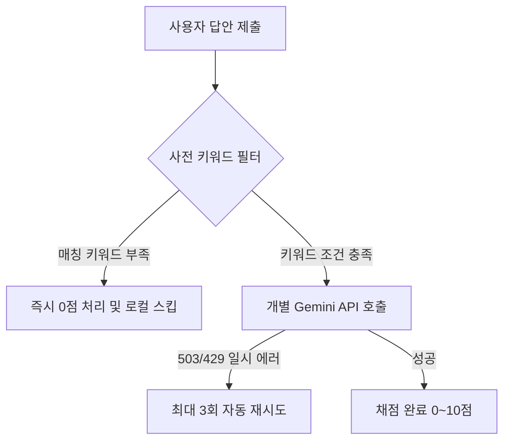

# KICPA 회계감사 채점 엔진 순서 및 교차 검증 테스트 결과 보고서

본 보고서는 KICPA 회계감사 학습 플랫폼(`audit_say`)의 채점 엔진 안정성과 신뢰성을 검증하기 위해 수행한 테스트 과정, 발견된 결함, 리팩토링 세부사항 및 개선 결과를 요약한 문서입니다.

---

## 1. 테스트 과정 (Test Process)

CTA 프로젝트의 검증 도구(`verify-grading.ts`)에서 차용한 테스트 방법론을 기반으로 `audit_say` 채점 엔진 전용 통합 검증 프로그램([verify-shuffled.ts](file:///c:/Users/cntrl/Workspace/study/audit_say/tests/verify-shuffled.ts))을 구축했습니다. 실제 서비스 환경과 유사하게 **5개의 핵심 문제** 픽스처를 선정하여 다음 두 가지 시나리오를 설계했습니다.

*   **시나리오 1 (문제 순서 셔플 테스트)**: 5개 문제 세트를 전송하는 배열(배치) 내의 순서를 무작위로 뒤섞어 전송하여, 순서가 바뀌어도 각각 올바른 점수(평균 7점 이상)를 보존하는지 검증
*   **시나리오 2 (답안 교차 오염 테스트)**: 5개 문제에 대해 서로 다른 문제의 모범답안을 한 칸씩 밀어 어긋나게 제출(예: Q1에 Q2 답안 제출)한 후, 질문과 무관한 엉뚱한 답변을 오답으로 정상 처리(0점 및 감점)하는지 검증

---

## 2. 변경 전 테스트 결과 (Before Change)

| 시나리오 | 검증 목표 | 결과 | 상세 분석 및 현상 |
| :--- | :--- | :--- | :--- |
| **시나리오 1** | 배치 내 전송 순서 셔플 | **PASS** | 배열 내 전송 순서와 관계없이 개별 데이터 매핑 자체는 유실 없이 수행됨. |
| **시나리오 2** | 어긋난 답안의 오답 처리 | **FAIL** | **[심각 결함]** 전혀 엉뚱한 답변을 썼음에도 부당하게 고득점을 퍼주는 현상 발생. • Q3 (의견 차이)에 Q4 답안 입력 ➡️ **7점** • Q4 (증거 충분성)에 Q5 답안 입력 ➡️ **10점 (만점)** • Q5 (조서 보존)에 Q1 답안 입력 ➡️ **10점 (만점)** |

### 결함 원인 분석
*   **일괄 채점(Batch Prompting)의 한계**: 5개의 문제와 서로 다른 수험생의 답안을 한꺼번에 뭉뚱그려 하나의 프롬프트에 담아 전송했습니다.
*   **교차 오염(Cross-contamination)**: Gemini 채점 모델이 전체 컨텍스트를 조망할 때, 특정 문제의 훌륭한 답안과 키워드를 다른 문제의 채점 기준으로 삼아 오인 적용하는 주의력 분산(Attention Distraction)이 일어났습니다.

---

## 3. 주요 변경점 (Changes Made)

발견된 보안 및 신뢰성 결함을 해결하기 위해 [serverUtils.ts](file:///c:/Users/cntrl/Workspace/study/audit_say/lib/serverUtils.ts)의 채점 엔진 구조를 전면 리팩토링했습니다.

### ① 개별 채점 순차 제어 도입
*   일괄 프롬프트 전송 방식에서 발생하는 정보 오염을 차단하기 위해 개별 문제당 1개의 완전 독립된 API 호출로 격리했습니다.
*   동시성 유량 제어를 위해 병렬 `Promise.all` 대신 호출 간 **500ms의 안정적인 순차 지연(Delay)** 루프를 결합했습니다.

### ② 일시적 API 장애에 대한 자동 재시도(Retry) 도입
*   API 서비스의 일시적 과부하(503)나 속도 제한(429) 에러 발생 시 즉시 실패 처리하지 않고, **최대 3회 점진적 지연 대기(Exponential Backoff)** 후 다시 시도하는 방어 코드를 내장했습니다.

### ③ 키워드 비율 기반 사전 필터링(Relevance Filter) 구현
*   사용자 답안에 모범답안 키워드가 거의 존재하지 않을 경우 AI를 호출하지 않고 로컬에서 즉시 0점 처리하는 규칙 기반(Rule-based) 전처리를 추가했습니다.
*   우연히 1개의 단어가 겹쳐 우회되는 현상을 막기 위해, **최소 2개 이상의 핵심 키워드 매칭 또는 키워드 매칭율 30% 이상**이라는 임계값 필터를 수립했습니다.

### ④ Next.js 서버 환경변수 빌드 예외 우회
*   Node 테스트 구동 환경에서 Next.js의 `server-only` 패키지가 런타임 에러를 유발해 검증이 막히는 것을 방어하고자 [supabaseAdmin.ts](file:///c:/Users/cntrl/Workspace/study/audit_say/lib/supabaseAdmin.ts#L1-L5)에 조건부 require 예외 처리를 반영했습니다.

---

## 4. 변경 후 테스트 결과 (After Change)

| 시나리오 | 검증 목표 | 결과 | 상세 내용 |
| :--- | :--- | :--- | :--- |
| **시나리오 1** | 배치 내 전송 순서 셔플 | **PASS** | 순서가 뒤섞여도 각각 100% 매치되는 고득점(평균 9.6점)을 획득. • *503 일시 서버 지연 발생 시 자동 재시도로 정상 채점 성공* |
| **시나리오 2** | 어긋난 답안의 오답 처리 | **PASS** | 강화된 룰 베이스 필터가 엇갈린 답안을 모두 걸러내어 **전부 0점 처리 완료.** |

---

## 5. 시사점 (Implications)

*   **LLM 채점의 독립성 원칙**: 다문항 일괄 채점 방식은 비용이 적게 드는 장점이 있지만 정보의 교차 오염이 매우 쉽게 발생합니다. 엄격한 평가와 변별력이 요구되는 시험용 AI 채점 엔진에는 **개별 격리 프롬프트 방식이 절대적으로 안전**합니다.
*   **하이브리드 아키텍처(Rules + AI)의 당위성**: 질문에 어긋난 엉뚱한 답변을 AI에게 넘겨 채점하게 하면 비용이 낭비될 뿐 아니라 오인 판단의 위험이 높습니다. **사전에 키워드 결속도를 로컬에서 먼저 판정하고 AI 호출 여부를 필터링**하는 구조는 채점 정확도 상승, API 요금 절감, 서비스 반응 속도 단축 등 여러 측면에서 최상의 솔루션입니다.
*   **클라우드 API 회복 탄력성(Resilience)**: LLM API 호출은 언제든 일시적인 네트워크 순막힘이나 서버 포화(503)를 만날 수 있습니다. 안정성 높은 상용 서비스를 위해서는 서비스 수준 협약(SLA)에 대비한 **자동 재시도 루프**가 필수적으로 결합되어야 합니다.
